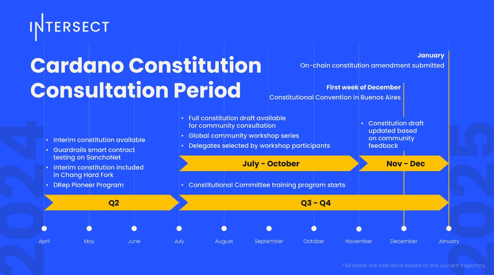

# Overview

The Chang upgrade marks a significant milestone for Cardano this year, as it puts the community at the forefront of blockchain governance.  Following the Chang upgrade, the Interim Constitution will be on-chain and in effect until the community ratifies another constitution.  The Interim Constitution is intended to be minimal and temporary, allowing for the Chang upgrade to proceed by fulfilling the requirement of CIP-1694 to have a Cardano Constitution.  The Interim Constitution therefore allows time for the community to converge on a more holistic constitution for Cardano.

The Cardano Constitution Consultation period span all of 2024, summarised in the roadmap:

<figure><figcaption></figcaption></figure>

The first half of 2024 included work across Intersect committees and staff to prepare for the latter half of 2024 where broad community engagement is taking place. The Cardano Civics Committee and Parameters Sub Committee have collaborated to prepare the Interim Constitution for the Change upgrade.  The Cardano Civics Committee, working with several relevant experts, have evaluated the Interim Constitution to identify areas for improvement, and develop a draft Constitution that align with Cardano’s vision for a decentralised, inclusive, and transparent governance structure.  The Draft Constitution serves as critical input for the Constitutional Workshops. 

Starting in August and ending by Oct 15th, the Constitutional Workshops were a series of community hosted workshops designed with two objectives:

1. Gather broad and diverse community input on the Draft Constitution.
2. Select Constitutional Delegates to attend the Constitutional Convention in Buenos Aires in Dec. 2024. Each workshop will select a ranked list of 5 candidates. First place is the Voting Delegate, 2nd place is the Travelling Alternate, 3rd place is the Backup Alternate #1, 4th place is the Backup Alternate #2, and 5th place is the Backup Alternate #3.

Each Constitutional workshop were designed to address specific outstanding questions related to the Draft Constitution.  Through structured discussions and interactive sessions, attendees responded to important questions that could not be resolved without broad community input. These workshops  developed actionable recommendations that became synthesised across 63 workshops to guide updates to the Draft Constitution. Constitutional Delegates are responsible for reviewing the updated draft at the Constitutional Convention to approve to proceed for on-chain voting.

 
